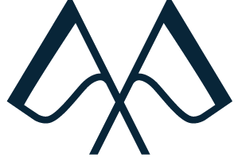

# Rascal UI Kit

> **🏛 Official Design Standard** for all Rascal Republic group apps (OKR Tracker, EPR, Account Portal, Leadership Portal, Rinjani Bay, Samara Lombok).
>
> This repo is the **canonical source of truth** for the visual language. When a class string, token, animation, or pattern here conflicts with app code, fix the **app** — not the doc.

## Governance

- All new Rascal apps **MUST** adopt this kit's tokens (colors, typography, spacing, radii) and **SHOULD** consume its component templates verbatim before forking.
- Changes to tokens or core patterns require:
  1. PR on this repo (with before/after screenshots if visual)
  2. Migration note in any impacted app's CHANGELOG / commit body
  3. Sync the relevant `docs/*.md` file in the same commit
- Diverge only when the app has a documented reason (linked from the divergent code). Drift without justification = bug, not feature.

---

## Contents

```
Rascal-UI-Kit/
├── docs/                      Design system documentation
│   ├── PRINCIPLES.md          Calm by Default — design philosophy
│   ├── DESIGN_SYSTEM.md       Tokens: color, spacing, radii
│   ├── BRAND_COLORS.md        Per-brand palette (Rascal corporate vs Rinjani/Samara villa)
│   ├── TYPOGRAPHY.md          Font stack (Aptos / Inter / Segoe UI) + scale
│   ├── DASHBOARD_PATTERNS.md  Layout patterns used across apps
│   ├── ANIMATIONS.md          Loading, transitions, micro-interactions
│   └── VOICE_AND_TONE.md      Copy guidelines
├── assets/
│   ├── logo/                  Brand kit — Rascal Republic, Rinjani Bay, Samara Lombok
│   │                          (navy/black/white SVG + PNG per brand)
│   └── animations/
│       ├── canonical-loading-preview.svg     Static preview of the boot loader (visual DNA)
│       ├── brand-loading-comparison.svg      Three-up: Rascal / Rinjani / Samara variants
│       └── animation_others/                 Inline animation variations (spinner, dots, pulse, bar)
├── templates/
│   ├── components/            Reusable React+Tailwind components
│   │                          (LoadingSpinner + Rascal/Rinjani/Samara pre-bound variants)
│   └── patterns/              Higher-order patterns (smart-gate card, etc.)
├── examples/                  Full-page layout examples
└── .claude/skills/rascal-ui/  Claude Code skill — apply the kit from any project
                               (install: cp -r .claude/skills/rascal-ui ~/.claude/skills/)
```

---

## Quick start

### Copy a component

Most templates are self-contained React+Tailwind 4 — drop into any Rascal app, adjust imports.

```tsx
// templates/components/StatCard.tsx
import StatCard from '@/components/StatCard';

<StatCard label="Direct reports" value={6} sub="active team members" tone="neutral" />
```

### Use a logo

Three SVG variants per brand: `-navy` (default in-app), `-black` (print/mono), `-white` (dark surfaces). See [assets/logo/README.md](assets/logo/README.md) for the full matrix.

```tsx
import logoUrl from '@rascal-ui-kit/assets/logo/rascalrepublic/rascalrepublic-navy.svg';

```

PNG fallback (for email signatures or contexts that strip SVG):

```html

```

Sister properties (Rinjani Bay, Samara Lombok) follow the same convention:

```tsx
import rinjaniLogo from '@rascal-ui-kit/assets/logo/rinjanibay/rinjanibay-navy.svg';
import samaraLogo  from '@rascal-ui-kit/assets/logo/samaralombok/samaralombok-navy.svg';
```

### Use an animation

```tsx

```

Or use the branded full-screen `LoadingSpinner` — the boot-loader DNA. **Pre-bound variants are easiest:** they wire the brand logo + ring color + background gradient automatically. Just pick the property:

```tsx
// Rascal Republic corporate apps
import RascalLoadingSpinner from '@rascal-ui-kit/templates/components/RascalLoadingSpinner';
<RascalLoadingSpinner appName="OKR Tracker" />

// Boutique villa apps — ring + bg pick the brand's signature accent (turquoise / sunset gold)
import RinjaniLoadingSpinner from '@rascal-ui-kit/templates/components/RinjaniLoadingSpinner';
<RinjaniLoadingSpinner appName="Rinjani Concierge" />

import SamaraLoadingSpinner from '@rascal-ui-kit/templates/components/SamaraLoadingSpinner';
<SamaraLoadingSpinner appName="Samara Booking" />
```

See [`docs/ANIMATIONS.md`](docs/ANIMATIONS.md) for the base `LoadingSpinner` API + custom ring/bg props, and [`docs/BRAND_COLORS.md`](docs/BRAND_COLORS.md) for per-brand palette tokens.

### Apply the kit from Claude Code

Install the bundled skill once, then invoke `/rascal-ui` in any project to apply the kit's standards (it loads the docs, surfaces a cheatsheet, runs an 11-point sanity check on generated code, and includes a low-technical prompt template for v0 / Lovable / Cursor):

```bash
cp -r .claude/skills/rascal-ui ~/.claude/skills/
```

Then in Claude Code: `/rascal-ui` — works from any repository.

---

## Design principles

> **Calm by Default** — read the full philosophy in [PRINCIPLES.md](docs/PRINCIPLES.md).

Operational shortcuts derived from the principles:

1. **Earn the pixel.** If an element can be removed without losing meaning, remove it.
2. **Signal beats decoration.** Color / weight / size encode meaning, not vibes. Tone choices map to semantic states.
3. **Function before form.** When UX and aesthetic conflict, function wins.
4. **Loud only when necessary.** Quiet baseline. Urgency, error, success states earn their loudness because the rest is calm.
5. **Stone is the only neutral.** Don't mix `gray-*`, `slate-*`, `zinc-*` in new code.
6. **Brand navy `#011132` for sidebar + auth only.** In-app actions use `stone-900` so the page stays calm.
7. **Emerald is the "yes, commit" signal.** Submit, completion, done — all emerald-600/700/800.
8. **Material Symbols Rounded for UI icons, emoji only from the allowlist.** See [DESIGN_SYSTEM.md](docs/DESIGN_SYSTEM.md).
9. **Same algorithm everywhere.** When the same number shows in two places (email + dashboard), it must come from the same source. See [DASHBOARD_PATTERNS.md → Email-dashboard sync](docs/DASHBOARD_PATTERNS.md).

---

## Apps that consume this kit

| App                    | Repo                                         | Notes                                  |
| ---------------------- | -------------------------------------------- | -------------------------------------- |
| **OKR Tracker**        | `RivoHenfri/UX-OKR-Tracker`                  | Primary executive surface              |
| **Rascal EPR**         | `RivoHenfri/Rascal-EPR`                      | OPTICS 2026 performance review         |
| **Leadership Portal**  | (internal)                                   | OKR submission UX                      |
| **Account Portal**     | (internal)                                   | IAM hub                                |

---

## License & ownership

Internal Rascal Republic asset. Not for external distribution.

---

## Changelog

See git log. Material changes to tokens or core components require:

1. PR with before/after screenshots
2. Migration note in the relevant app's CHANGELOG
3. Sync the impacted MD doc in the same commit
